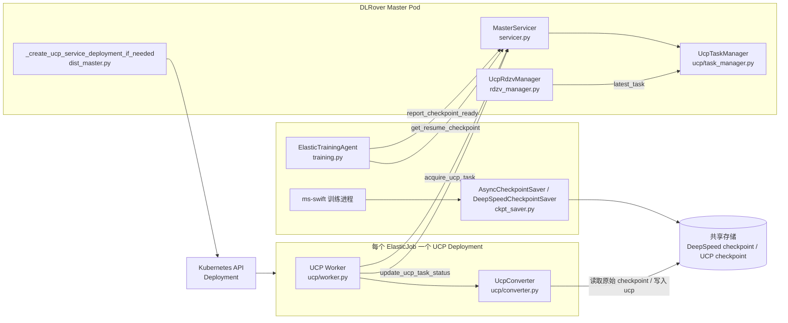
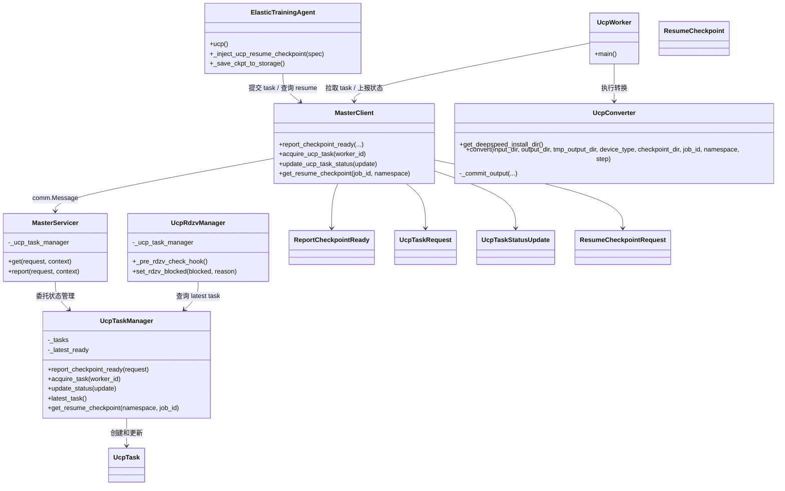
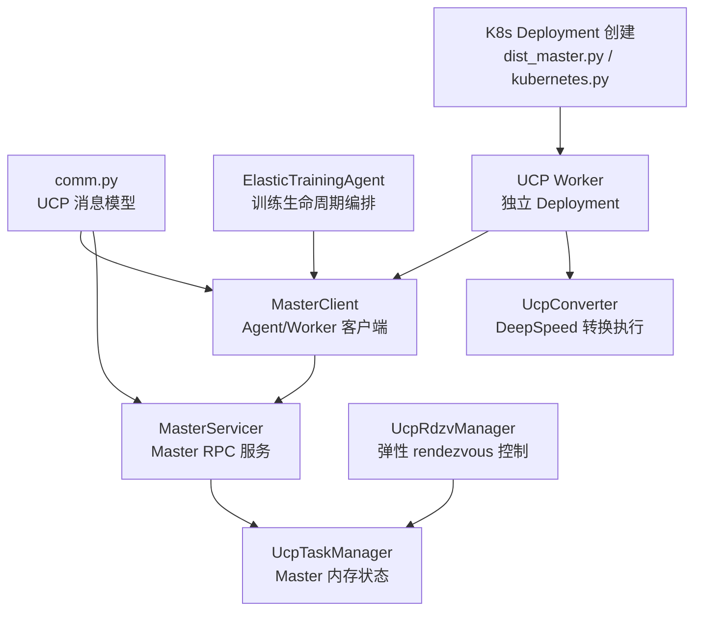
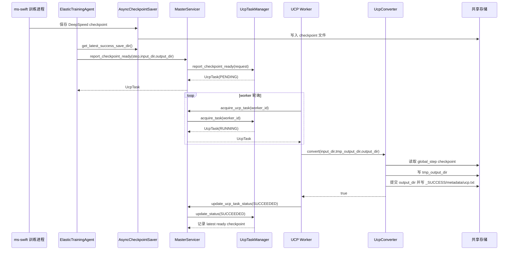
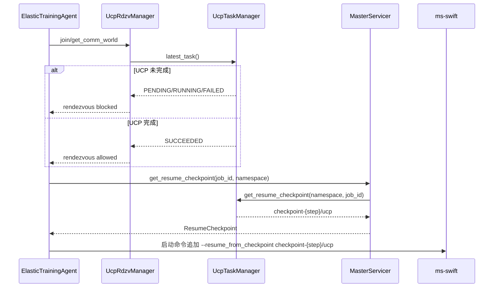
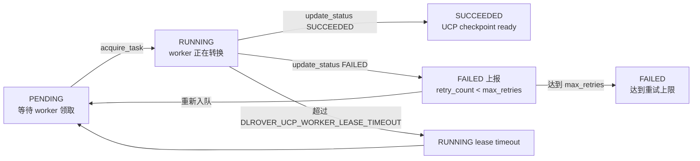
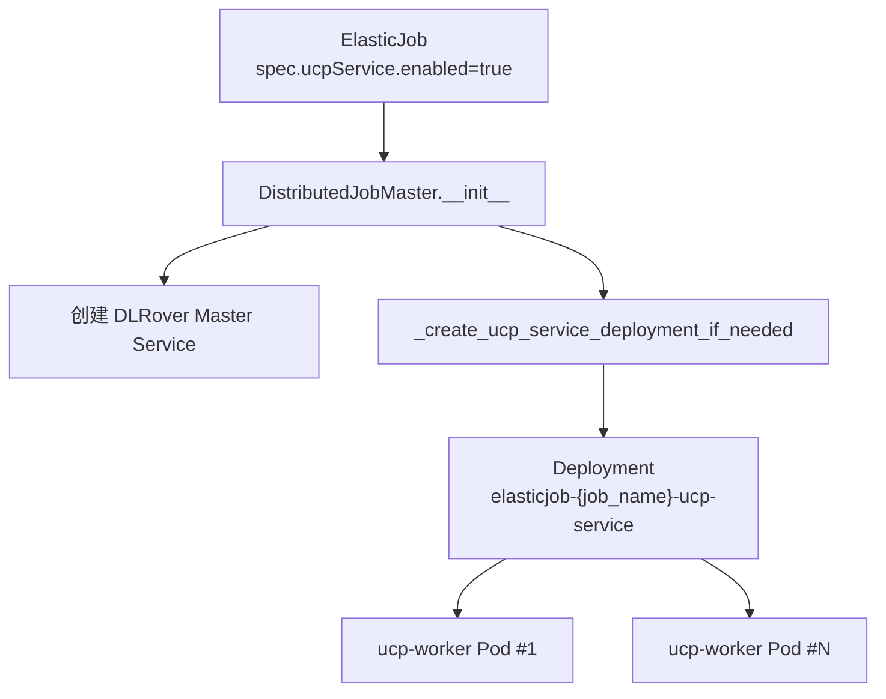

# DLRover UCP Service 当前实现架构说明

本文档基于当前代码实现整理 UCP Service 的架构、组件职责、类关系和关键运行时序。当前实现采用“方案 A”：每个 ElasticJob 创建一个专属 UCP Service Deployment，UCP task 状态由 DLRover Master 进程内的 `UcpTaskManager` 管理，UCP worker 独立执行 DeepSpeed universal checkpoint 转换。

## 总体架构



当前实现的核心边界：

- 训练 Pod 只负责保存原始 checkpoint，并在需要 UCP 时向 Master 提交 task。
- DLRover Master 负责 UCP task 生命周期、rendezvous 阻塞判断和 resume checkpoint 查询。
- UCP Service 是独立 Deployment，负责拉取 task 并执行转换。
- 共享存储是训练 Pod 和 UCP worker 之间的数据交换边界。

## 组件职责

### ElasticTrainingAgent

源码位置：`dlrover/python/elastic_agent/torch/training.py`

职责：

- 在 `ucp()` 中等待 latest successful checkpoint。
- 构造 DeepSpeed checkpoint 输入路径：
  - `{checkpoint_dir}/checkpoint-{step}/global_step{step}`
- 构造 UCP 输出路径：
  - `{checkpoint_dir}/checkpoint-{step}/ucp`
- 调用 `MasterClient.report_checkpoint_ready(...)` 提交 UCP task。
- 在启动 workers 前调用 `_inject_ucp_resume_checkpoint(...)`：
  - 仅 `DLROVER_TRAINING_ELASTIC_MODE=ucp` 生效。
  - 仅对包含 `swift` 或 `ms-swift` 的命令追加 resume 参数。
  - 如果已有 `--resume_from_checkpoint`，不重复追加。

### MasterClient

源码位置：`dlrover/python/elastic_agent/master_client.py`

职责：

- 封装 UCP 相关 Master RPC：
  - `report_checkpoint_ready(...)`
  - `acquire_ucp_task(worker_id)`
  - `update_ucp_task_status(update)`
  - `get_resume_checkpoint(job_id, namespace)`
- 复用现有 DLRover `comm.Message` 通信体系，不新增独立 HTTP API。

### MasterServicer

源码位置：`dlrover/python/master/servicer.py`

职责：

- 在 `get()` 中处理：
  - `ReportCheckpointReady`
  - `UcpTaskRequest`
  - `ResumeCheckpointRequest`
- 在 `report()` 中处理：
  - `UcpTaskStatusUpdate`
- 将请求转发到 Master 进程内 singleton `UcpTaskManager`。

### UcpTaskManager

源码位置：`dlrover/python/master/elastic_training/ucp/task_manager.py`

职责：

- 维护 Master 进程内 UCP task 状态。
- 以 `namespace:job_id:step` 作为幂等 key。
- 创建 task，默认状态为 `PENDING`。
- 将 `PENDING` task 分配给 UCP worker，并切换为 `RUNNING`。
- 处理 worker 状态上报：
  - `SUCCEEDED`：记录 latest ready UCP checkpoint。
  - `FAILED`：未超过 `DLROVER_UCP_MAX_RETRIES` 时重新置为 `PENDING`，否则最终失败。
- 对超出 `DLROVER_UCP_WORKER_LEASE_TIMEOUT` 的 `RUNNING` task 重新入队。

### UcpRdzvManager

源码位置：`dlrover/python/master/elastic_training/rdzv_manager.py`

职责：

- 在 rendezvous pre-check 中读取 latest UCP task。
- 如果 latest task 为 `SUCCEEDED`，放行 rendezvous。
- 如果 latest task 为 `PENDING`、`RUNNING` 或默认 `FAILED`，阻塞 rendezvous。
- 如果 `DLROVER_UCP_ALLOW_FAILURE_FALLBACK=true`，允许 failed task 放行。

### UCP Worker

源码位置：`dlrover/python/elastic_agent/torch/ucp/worker.py`

职责：

- 作为独立 UCP Service Deployment 中的主进程运行。
- 等待 DLRover Master 可连接。
- 周期性调用 `acquire_ucp_task(worker_id)` 拉取 task。
- 调用 `UcpConverter.convert(...)` 执行转换。
- 转换完成后调用 `update_ucp_task_status(...)` 上报成功或失败。

### UcpConverter

源码位置：`dlrover/python/elastic_agent/torch/ucp/converter.py`

职责：

- 定位 DeepSpeed 安装目录。
- 调用：
  - `deepspeed/checkpoint/ds_to_universal.py`
- 将转换结果先写入 `tmp_output_dir`。
- 转换成功后提交到 `output_dir`。
- 写入：
  - `{output_dir}/metadata.json`
  - `{output_dir}/_SUCCESS`
  - `{checkpoint_dir}/ucp.txt`

### Kubernetes UCP Deployment 创建逻辑

源码位置：

- `dlrover/python/master/dist_master.py`
- `dlrover/python/scheduler/kubernetes.py`
- `dlrover/python/scheduler/job.py`
- `examples/pytorch/mnist/elastic_job.yaml`

职责：

- Master 启动时，如果满足以下条件则创建 UCP Deployment：
  - Kubernetes 或 PyKubernetes 平台。
  - `training_elastic_mode=ucp`。
  - `spec.ucpService.enabled=true`。
- Deployment 名称：
  - `elasticjob-{job_name}-ucp-service`
- 默认复用 worker image、resources、volumes 和 volumeMounts。
- UCP worker 通过 `DLROVER_MASTER_ADDR` 连接当前 job 的 DLRover Master。

## 类图



## 组件关系图



## 时序图：checkpoint ready 到 UCP 转换完成



## 时序图：弹性 rendezvous 与 ms-swift 恢复



## 流程图：UCP task 状态机



## 部署图：每个 ElasticJob 一个 UCP Deployment



当前 Deployment 行为：

- `ucpService.image` 未配置时复用 worker 主容器 image。
- `ucpService.resources` 未配置时复用 worker resources。
- `ucpService.volumeMounts` / `ucpService.volumes` 未配置时复用 worker 的挂载配置。
- worker command 默认为：

```bash
python -m dlrover.python.elastic_agent.torch.ucp.worker
```

## 配置入口

示例位于 `examples/pytorch/mnist/elastic_job.yaml`：

```yaml
spec:
  ucpService:
    enabled: true
    replicas: 1
    deviceType: cpu
    resources:
      limits:
        cpu: "8"
        memory: 64Gi
      requests:
        cpu: "8"
        memory: 64Gi
```

常用环境变量：

- `DLROVER_UCP_MAX_RETRIES`：UCP task 最大重试次数，默认 `3`。
- `DLROVER_UCP_WORKER_LEASE_TIMEOUT`：worker lease 超时时间，默认 `300` 秒。
- `DLROVER_UCP_POLL_INTERVAL`：worker 轮询间隔，默认 `5` 秒。
- `DLROVER_UCP_TASK_TIMEOUT`：task 超时时间字段，当前用于随 task 传递。
- `DLROVER_UCP_DEVICE_TYPE`：转换设备类型，默认 `cpu`。
- `DLROVER_UCP_ALLOW_FAILURE_FALLBACK`：UCP failed 时 rendezvous 是否允许 fallback，默认 `false`。

## 当前实现约束

- `UcpTaskManager` 是 Master 进程内内存状态，Master 重启后 UCP task 状态不会恢复。
- 当前 UCP 转换实现绑定 DeepSpeed `ds_to_universal.py`。
- ms-swift 集成采用命令行参数注入方式，不修改 ms-swift 内部逻辑。
- UCP worker 和训练 Pod 必须看到一致的 checkpoint 路径和共享存储挂载。
- `ucp.txt` 仍作为兼容 marker 写入，但当前控制面判断以 Master 中的 task status 为主。
